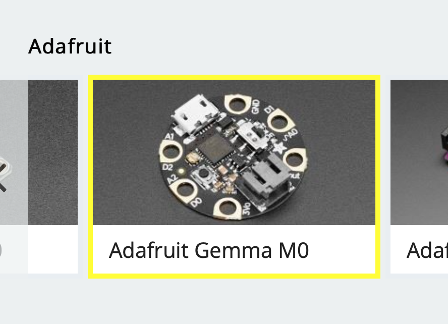

# RS M0 Necklace Dev Kit

The RS M0 Necklace Dev Kit is a tiny dev board based on the insanely powerful Atmel SAMD21 series of Arm M0 based processors.

This repo contains all of the design files so that you can understand the circuit and even remix and build upon it yourself!

## Usage

The UF2 bootloader means that you can drag-and-drop your compiled code onto the dev kit as it if was a USB memory stick.

You can create programs using [Microsoft Make Code][make code]. Use the `Adafruit Gemma M0` as the device as the RS M0 Necklace Devkit isn't available to the public just yet!

After creating your program, click on download and drag-n-drop the .uf2 file onto your RS M0 USB drive - it's as simple as that!

## Troubleshooting

If your dev kit isn't immediately recognised by your computer then you may need to install some drivers from [here][ada-drivers]. Mac, Linux, and most Windows 10 users won't need to do this. If you need more guidance then take a look at [this guide from Adafruit][ada-driver-guide].

## License and Credit

The RS M0 Necklace Dev Kit is based on the [Adafruit Gemma M0][ada-m0], licensed under Creative Commons Attribution-ShareAlike 3.0 Unported.

This project is also released under Creative Commons Attribution-ShareAlike 3.0 Unported.

The bootloader is based upon the [Microsoft UF2 Bootloader][uf2], licensed under the MIT license.

Additional resources were used from Sparkfun and other sources. For more information see `license.txt`.

We have:

- added a placeholder for a battery charger,
- added a PCB-USB connector so you can get coding without any extra cables,
- broken out the data pins for the Neopixel so you can add external LEDs easily,
- added some through-hole footprints so that you can solder on 0.1" pin header and put your dev kit into a breadboard.
- recompiled the bootloader to include the dev kit's name

This project was carried out on behalf of [RS Components Grassroots][grass-roots] by [Embedism][emb].

[//]: #
[ada-m0]: https://github.com/adafruit/Adafruit-Gemma-M0-PCB
[uf2]: https://github.com/Microsoft/uf2
[grass-roots]: https://uk.rs-online.com/web/generalDisplay.html?id=Grass-Roots
[emb]: https://embedism.com
[make code]: https://maker.makecode.com/#
[ada-drivers]: https://github.com/adafruit/Adafruit_Windows_Drivers/releases/tag/2.5.0.0
[ada-driver-guide]: https://learn.adafruit.com/adafruit-gemma-m0/windows-driver-installation
